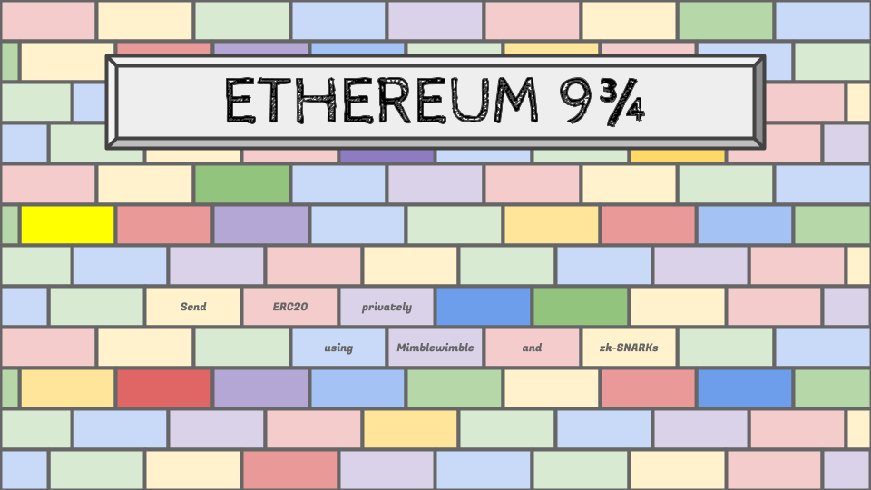

# Ethereum 9¾

Send ERC20s privately using Mimblewimble and zk-SNARKs!



## Summary

Please check out technical details [here.](https://ethresear.ch/t/ethereum-9-send-erc20-privately-using-mimblewimble-and-zk-snarks/6217)

1. Ethereum 9¾ uses **Mimblewimble transaction** and it prevents printing money out of thin air.
1. With **spent tags(nullifier)**, Ethereum 9¾ completely hides where the inputs come from.
1. Ethereum 9¾ manages TXOs using **zk RollUp**. Thus it stores only the root value of the tree on Ethereum.
1. It uses **Pedersen Merkle Mountain Range** for its data structure and it allows an efficient zk-RollUp.
1. It also supports **optimistic roll up** to reduce the gas costs per transactions.
1. Using optimistic roll up, relayers can **aggregate transactions up to 32 txs at once and collect transaction fees**.

## Pre-requisite

Install docker and [configure](https://docs.docker.com/docker-for-mac/#advanced) to allow at least 13GB memory.
Install GNU Make & Python3 & Python virtualenv

You can run some of the tests below without docker using `test-host...` instead of `test...` command below.
In this case you will have to [install ZoKrates](https://zokrates.github.io/gettingstarted.html#one-line-install)

## Make commands

- `make test`: Test circuits, python library, and contracts
- `make test-circuits`: Test zk-SNARKs circuits
- `make test-py934`: Test python library for Mimblewimble & Pedersen MMR tree
- `make test-conctracts`: Test Ethereum934.sol contracts & zk-SNARKs verifier contracts

## What does this project include

1.  zk-SNARKs Circuits

    ```shell
    ├── circuits
    │   ├── mmr
    │   │   ├── ...
    │   │   ├── zkMMRInclusion.zok # Verfies inclusion of an item in the given MMR root.
    │   │   ├── zkRollUp1.zok # Updates MMR root appending 1 item.
    │   │   ├── zkRollUp2.zok # Updates MMR root appending 2 items.
    │   │   ├── zkRollUp4.zok # Updates MMR root appending 4 items.
    │   │   ├── zkRollUp8.zok # Updates MMR root appending 8 items.
    │   │   ├── zkRollUp16.zok # Updates MMR root appending 16 items.
    │   │   ├── zkRollUp32.zok # Updates MMR root appending 32 items.
    │   │   └── zkRollUp64.zok # Updates MMR root appending 64 items.
    │   ├── ...
    │   ├── zkDeposit.zok # Verifies depositing spent tag(nullifier) satisfies the given condition.
    │   ├── zkMimblewimble.zok # Verifies the transaction satisfies the Mimblewimble protocol.
    │   ├── zkRangeProof.zok # Verifies the given TXO's value is between the given range.
    │   └── zkWithdraw.zok # Verifies the withdrawing TXO exists in the given root.
    ├── containers: Dockerfiles to make proof generator containers using the above circuits.
    ├── tests
    │   ├── circuits
    │   │   ├── ...
    │   │   └── unitTest.zok # Tests Mimblewimble circuits and MMR circuits
    ├── utils
    │   └── create_challenge_circuit.py # Forked from Zokrates utils. It generates a circuit to calculate tx challenge.
    ```

1.  Py934: Python library for Mimblewimble transaction and Pedersen MMR tree.

    ```shell
    ├── py934
    │   ├── ...
    │   ├── jubjub.py # Implements field on the BabyJubjub curve
    │   ├── mimblewimble.py # Implements Mimblewimble transaction builder for Ethereum 9 3/4
    │   └── mmr.py # Pedersen MMR implementation
    ├── tests
    │   ├── test_field.py # Test BabyJubjub curve arithmetics.
    │   ├── test_mimblewimble.py # Test Mimblewimble transaction building library
    │   └── test_mmr.py # Test python implementation of Pedersen MMR
    ├── sample.py # Script to generate test dataset. They will be used for solidity testing.
    ├── setup.py # Py934 PyPI configuration
    ├── requirements.txt # Python package dependency
    ├── requirements-dev.txt # Python packages for development environment
    ```

1.  Smart contracts: Solidity smart contracts to verify ZKPs

    ```shell
    ├── contracts
    │   ├── generated # Automatically generated Verifiers using Zokrates
    │   ├── ...
    │   ├── Ethereum934.sol # Main application
    │   ├── ZkInterfaces.sol # Interface to call zkp verification functions
    │   └── ZkSANRKs.py # Solidity to get artifacts of automatically generated contracts
    ├── tests
    │   ├── dataset # json files generated by sample.py
    │   ├── Ethereum934.test.js # Test depositing, rollin up, withdrawing. Using scenarios are here.
    │   └── ZkSANRKs.test.js # Test and benchmark how much each ZK verification function costs
    ├── package.json # Makes Ethereum934 contract as a node module
    ├── truffle-config.json # Truffle framework configuration
    ├── scripts # Testing scripts for solidity
    ```

## How to build transaction and submit to Ethereum?

1. Deposit and create a coinbase
   ```python
   txo = Output.new(132)
   deposit_proof = txo.deposit_proof
   ```
   Make a txo to deposit 132 amount of ERC20 tokens. You need to submit the deposit proof to use that txo.
   The deposit proof guarantees that you know the secret keys and the value will not occur overflow during zk-SNARKs computation.
1. Inclusion proof to use exising TXO

   ```python
   txo_1 = Output.new(31) # sample
   txo_2 = Output.new(32) # sample
   txo_3 = Output.new(33) # sample
   mmr = PedersenMMR()
   mmr.append(txo_1.hh)
   mmr.append(txo_2.hh)
   mmr.append(txo_3.hh)
   inclusion_proof_of_txo_1 = mmr.get_inclusion_proof(1)
   zk_inclusion_proof = inclusion_proof_of_txo_1.zk_proof(txo_1.r, txo_1.v)
   ```

   From Pedersen MMR, get an inclusion proof for the item to use as an input txo. It will return an inclusion proof that
   the current root definitely includes the given spent tag(nullifier).
   Using this zk inclusion proof, we can sever the link between the input TXOs and output TXOs!

1. Make a send request
   ```python
   # Build transaction first
   tx_send = TxSend.builder(). \
               value(value_to_send). \
               fee(fee_for_relayer). \
               input_txo(input_txo_1, zk_inclusion_proof_1). \
               input_txo(input_txo_2, zk_inclusion_proof_2). \
               change_txo(change_txo). \
               metadata(address_of_erc20, expiration_height). \
               sig_salt(sender_sig_salt). \
               build()
   serialized_request = tx_send.serialize() # returns bytes
   ```
   `input_txo_2` and `inclusion_proof_2` can be None. It is just an option to use 2 input TXOs for a transaction.
   And `sender_sig_salt` is a random number in the Jubjub field for Schnorr signature.
1. Make a response against the request
   ```python
   deserialized_request = Request.deserialize(serialized_request)
   tx_receive = TxReceive.builder(). \
       request(deserialized_request). \
       output_txo(output_txo). \
       sig_salt(receiver_sig_salt). \
       build()
   serialized_response = tx_receive.response.serialize()
   ```
   For a given send request, the recipient should make an own TXO and a Schnorr signature to receive the transaction.
   Python library will automatically include the range proof for that given output TXO.
1. How to make a transaction? Just merge them!
   ```python
   response = Response.deserialize(serialized_response)
   transaction = tx_send.merge(response)
   ```
   Sender can complete to make the transaction by merging the request and response.
   And the Schnorr signature will do a role of receipt for the transaction.
1. Make the roll up proof
   ```python
   current_root = copy.deepcopy(mmr.root)
   current_width = copy.deepcopy(mmr.width)
   current_peaks = copy.deepcopy(mmr.peaks)
   mmr = PedersenMMR.from_peaks(16, current_peaks)
   items_to_update = [
       txo_1.hh,
       txo_2.hh,
       txo_3.hh,
       txo_4.hh,
   ]
   for item in items_to_update:
       mmr.append(item)
   new_root = mmr.root
   proof = PedersenMMR.zk_roll_up_proof(current_root, current_width, current_peaks, items_to_update, new_root)
   ```
   Relayers can aggregate transactions and make a roll up request. Metadata includes the ERC20 address & expiration height.
   If the submission does not satisfy correct ERC20 address and expiration, the contract will not the tx and roll up request.

## How to generate ZKP manually?

You can also use docker containers to generate some proofs manually. Python library also uses those docker containers.

ex)

```shell
[Command example]
docker run -e args="3 3 3" ethereum934/zk-range-proof

[List of proof generator containers]
- ethereum934/zk-deposit
    - public: [tag, v]
    - private: [r]
    - circuit: circuits/zkDeposit.zok
- ethereum934/zk-range-proof
    - public: [y]
    - private: [r, v]
    - circuit: circuits/zkRangeProof.zok
- ethereum934/zk-mimblewimble
    - public: [fee, metadata, tag1, tag2, output[2], change[2], sigPoint[2]]
    - private: [excess[2], sigScalar[2], inputR1, inputR2, inputV1, inputV2]
    - circuit: circuits/zkMimblewimble.zok
- ethereum934/zk-mmr-inclusion
    - public: [root, tag]
    - private: [xPeaks[16], yPeaks[16], position, r, v, xSiblings[16], ySiblings[16]]
    - circuit: circuits/mmr/zkMMRInclusion.zok
- ethereum934/zk-roll-up-1
    - public: [root, width, item[2], newRoot]
    - private: [xPeaks[16], yPeaks[16]]
    - circuit: circuits/mmr/zkRollUp1.zok
- ethereum934/zk-roll-up-2
    - public: [root, width, xItems[2], yItems[2], newRoot]
    - private: [xPeaks[16], yPeaks[16]]
    - circuit: circuits/mmr/zkRollUp2.zok
- ethereum934/zk-roll-up-4
    - public: [root, width, xItems[4], yItems[4], newRoot]
    - private: [xPeaks[16], yPeaks[16]]
    - circuit: circuits/mmr/zkRollUp4.zok
- ethereum934/zk-roll-up-8
    - public: [root, width, xItems[8], yItems[8], newRoot]
    - private: [xPeaks[16], yPeaks[16]]
    - circuit: circuits/mmr/zkRollUp8.zok
- ethereum934/zk-roll-up-16
    - public: [root, width, xItems[16], yItems[16], newRoot]
    - private: [xPeaks[16], yPeaks[16]]
    - circuit: circuits/mmr/zkRollUp16.zok
- ethereum934/zk-roll-up-32
    - public: [root, width, xItems[32], yItems[32], newRoot]
    - private: [xPeaks[16], yPeaks[16]]
    - circuit: circuits/mmr/zkRollUp32.zok
- ethereum934/zk-roll-up-64
    - public: [root, width, xItems[64], yItems[64], newRoot]
    - private: [xPeaks[16], yPeaks[16]]
    - circuit: circuits/mmr/zkRollUp64.zok
- ethereum934/zk-withdraw
    - public: [root, tag, v]
    - private: [r, xPeaks[16], yPeaks[16], position, xSiblings[16], ySiblings[16]]
    - circuit: circuits/zkWithdraw.zok
```

## Performance

Test machine: Ryzen1700 (3GHz 8 Core) + DDR4 32Gb

#### Roll up performance

|                          | Gas(Avg)  | Gas per tx | Maximum TPS   |
| ------------------------ | --------- | ---------- | ------------- |
| Roll up 1 tx             | 3,859,179 | 3,859,179  | 0.17 tx / sec |
| Roll up 2 tx             | 6,645,227 | 3,322,613  | 0.20 tx / sec |
| Optimistic roll up 16 tx | 2,492,927 | 155,807    | 4.25 tx / sec |
| Optimistic roll up 32 tx | 4,694,516 | 146,703    | 4.53 tx / sec |

#### Circuit performance

| Circuits                      | Constraint points | Gas consumption | Proof generation time |
| ----------------------------- | ----------------- | --------------- | --------------------- |
| Deposit proof                 | 29,140            | 612,273         | 3 seconds             |
| Withdraw proof                | 588,910           | 658,043         | 3.5 seconds           |
| Range proof                   | 19,679            | 568,232         | 2 seconds             |
| MMR Inclusion Proof           | 399,644           | 613,809         | 24 seconds            |
| Mimblewimble Proof            | 141,552           | 975,399         | 9 seconds             |
| MMR Roll up 2 items (1 txs)   | 644,957           | 1,392,269       | 1m 47s                |
| MMR Roll up 4 items (2 txs)   | 968,099           | 1,392,269       | 1m 47s                |
| MMR Roll up 8 items (4 txs)   | 1,614,383         | 1,392,269       | 1m 47s                |
| MMR Roll up 16 items (8 txs)  | 2,906,951         | 2,127,267       | 3m 19s                |
| MMR Roll up 32 items (16 txs) | 5,492,087         | 3,597,531       | 7m 20s                |
| MMR Roll up 64 items (32 txs) | 10,662,359        | 6,541,946       | 17m 30s               |

```shell
  Contract: Ethereum934
    deposit()
      ✓ Deposit ERC20 and create the first coinbase. (676677 gas)
      ✓ Deposit ERC20 and create the second coinbase. (661549 gas)
    rollUp()
      ✓ Round 1: roll up 2 Mimblewimble txs spending 1 coinbase for each. (5288641 gas)
      ✓ Round 2: roll up 2 Mimblewimble txs spending 2 hidden TXOs and 1 hidden TXO. (7047862 gas)
      ✓ Round 3: roll up 2 Mimblewimble txs spending 2 hidden TXOs for each. (7663886 gas)
      ✓ Round 4: roll up 1 Mimblewimble tx spending 1 hidden TXO. (3566770 gas)
      ✓ Round 5: roll up 1 Mimblewimble tx spending 2 hidden TXOs. (4182980 gas)
    optimisticRollUp()
      ✓ Round 6: optimistic roll up 4 Mimblewimble transactions. (848388 gas)
      ✓ Round 7: optimistic roll up 8 Mimblewimble transactions. (1396853 gas)
      ✓ Round 8: optimistic roll up 16 Mimblewimble transactions. (2493375 gas)
      ✓ Round 9: optimistic roll up 32 Mimblewimble transactions. (4694516 gas)
    withdraw()
      ✓ should prevent double spending. (46432 gas)
      ✓ should withdraw ERC20 with zk proof spending a hidden TXO. (715083 gas)

  Contract: ZkInterfaces
    ✓ Deposit proof (612273 gas)
    ✓ Range proof (568232 gas)
    ✓ Inclusion proof (613809 gas)
    ✓ Mimblewimble proof (975399 gas)
    ✓ Roll Up 2 items to the Pedersen Merkle Mountain Range (841457 gas)
    ✓ Roll Up 4 items to the Pedersen Merkle Mountain Range (1023228 gas)
    ✓ Roll Up 8 items to the Pedersen Merkle Mountain Range (1392269 gas)
    ✓ Roll Up 16 items to the Pedersen Merkle Mountain Range (2127267 gas)
    ✓ Roll Up 32 items to the Pedersen Merkle Mountain Range (3597531 gas)
    ✓ Roll Up 64 items to the Pedersen Merkle Mountain Range (6541946 gas)
    ✓ Withdraw proof (658043 gas)
```

## How to contribute

##### Export verifier contracts for a circuit

1. Export verifier using an existing docker image.
   ```shell
   docker run --name mw-proof-generator ethereum934/zk-mimblewimble /bin/bash -c "./zokrates export-verifier"
   docker cp mw-proof-generator:/home/zokrates/verifier.sol contracts/generated/MimblewimbleVerifier.sol
   ```
1. Export updated verifier with building a new image.

   ```shell
   # Specify the circuit path to compile and export the verifier contract
   make verifier circuit=YOUR_CIRCUIT_PATH

   # Specify the output path
   make verifier circuit=YOUR_CIRCUIT_PATH output=MyVerifier.sol
   ```

##### Update dataset for solidity test

```shell
python sample.py
mv build/*.json test/dataset/ethereum934/
```
